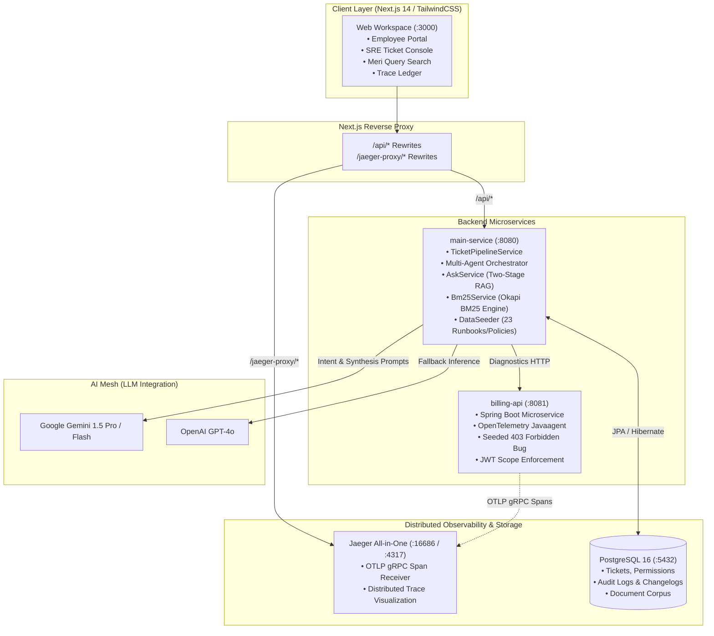
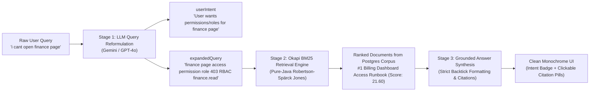

# Velloe (Meridian)

> **Autonomous IT Issue Triage System & Distributed Knowledge Copilot**  
> *Self-healing microservice diagnostics, multi-agent root-cause resolution, and two-stage Okapi BM25 knowledge retrieval.*

[](https://openjdk.org/)
[](https://spring.io/projects/spring-boot)
[](https://nextjs.org/)
[](https://www.postgresql.org/)
[](https://opentelemetry.io/)
[](https://www.jaegertracing.io/)
[](https://tailwindcss.com/)

---

## 📑 Table of Contents
- [Executive Overview](#-executive-overview)
- [System Architecture](#-system-architecture)
- [Core Capabilities](#-core-capabilities)
  - [1. Autonomous Multi-Agent Ticket Triage Pipeline](#1-autonomous-multi-agent-ticket-triage-pipeline)
  - [2. Two-Stage RAG: LLM Intent Reformulation & Okapi BM25](#2-two-stage-rag-llm-intent-reformulation--okapi-bm25)
  - [3. Dual-Persona RBAC & Employee Portal](#3-dual-persona-rbac--employee-portal)
  - [4. Distributed Tracing & Jaeger Telemetry](#4-distributed-tracing--jaeger-telemetry)
- [Technology Stack](#-technology-stack)
- [Repository Structure](#-repository-structure)
- [Getting Started](#-getting-started)
  - [Prerequisites](#prerequisites)
  - [Step 1: Start Infrastructure (PostgreSQL + Jaeger)](#step-1-start-infrastructure-postgresql--jaeger)
  - [Step 2: Build & Start Backend Microservices](#step-2-build--start-backend-microservices)
  - [Step 3: Launch Frontend Dashboard](#step-3-launch-frontend-dashboard)
- [API Reference](#-api-reference)
- [License](#-license)

---

## 🔭 Executive Overview

In complex cloud architectures, service-to-service communication failures, token scope discrepancies, and database connection pool starvation lead to repetitive IT helpdesk tickets and delayed incident triage.

**Velloe (codenamed Meridian)** is an enterprise-grade autonomous issue-triage platform and runbook copilot designed to bridge the gap between developers, employees, and site reliability engineers (SREs).

### What Velloe Delivers:
1. **Autonomous Multi-Agent Triage**: When tickets are filed (e.g. `403 Forbidden` on `/billing/dashboard`), a distributed pipeline of specialized agents diagnoses spans in Jaeger, correlates git changelogs/PRs, queries runbooks, validates IAM policies, and generates surgical remediation steps.
2. **Two-Stage RAG Copilot ("Meri")**: A conversational systems copilot that parses vague user questions, extracts explicit user intent, expands query terms using domain-specific keywords, and queries a pure-Java Okapi BM25 document corpus with inline citations and a sliding document inspector.
3. **Transparent Employee Experience**: Dynamic AI explanations that elucidate *why* access requests or tickets were rejected, provide root-cause analyses, and guide users with numbered self-service steps.
4. **Strict Monochrome Engineering Design**: A high-efficiency black-and-white user interface built with Next.js 14, Framer Motion, and monospace technical chips.

---

## 🏛 System Architecture



---

## ⚡ Core Capabilities

### 1. Autonomous Multi-Agent Ticket Triage Pipeline

When an employee submits a ticket or an alert triggers, `TicketPipelineService` orchestrates an autonomous sequence of specialized agent stages:

```mermaid
sequenceDiagram
    autonumber
    actor User as Employee / System Alert
    participant Pipe as TicketPipelineService
    participant Diag as Diagnostic Analyzer
    participant Audit as Change Auditor
    participant Run as Runbook Agent
    participant Pol as Policy Validator
    participant Res as Resolution Synthesizer
    participant DB as PostgreSQL 16

    User->>Pipe: Submit Ticket (e.g. 403 missing_scope on /billing/dashboard)
    Pipe->>Diag: 1. Trace Waterfall & Error Analysis
    Diag-->>Pipe: Discovered 403 Forbidden on billing-api (missing 'billing.read')
    Pipe->>Audit: 2. Changelog & PR Correlation
    Audit-->>Pipe: Matched PR #341: "Refactored role templates, dropped default scopes"
    Pipe->>Run: 3. BM25 Knowledge Retrieval
    Run-->>Pipe: Retrieved "Billing Dashboard Access Runbook" (BM25: 18.59)
    Pipe->>Pol: 4. RBAC & Security Validation
    Pol-->>Pipe: Verified least-privilege policy; employee is finance-analyst
    Pipe->>Res: 5. AI Synthesis & Patch Generation
    Res-->>Pipe: Generated root-cause analysis, approval action & next steps
    Pipe->>DB: Persist Execution Steps, Status & Explanation
```

---

### 2. Two-Stage RAG: LLM Intent Reformulation & Okapi BM25

Rather than feeding raw conversational queries directly into keyword search or vector databases, Velloe implements a **Two-Stage Retrieval Pipeline**:



#### Okapi BM25 Formula Implementation:
Implemented in `Bm25Service.java` with zero external indexing dependencies:
$$	ext{Score}(D, Q) = \sum_{t \in Q} 	ext{IDF}(t) \cdot rac{f(t, D) \cdot (k_1 + 1)}{f(t, D) + k_1 \cdot \left(1 - b + b \cdot rac{|D|}{	ext{avgdl}}
ight)}$$
*Where $k_1 = 1.2$, $b = 0.75$, and technical hyphenated identifiers (e.g. `billing-api`) are tokenized for granular sub-word matching.*

---

### 3. Dual-Persona RBAC & Employee Portal

- **Employee Persona**:
  - Direct ticket submission and real-time status tracking.
  - **Dynamic AI Explanations**: When a ticket is rejected or closed, an AI explanation card details:
    - **Headline & Category**
    - **Rejection Reason**: Transparent explanation of why the action was prevented.
    - **Root-Cause Analysis**: Deep dive into the underlying policy or configuration mismatch.
    - **Numbered Next Steps**: Clear, actionable self-service resolution paths.
- **SRE Admin Persona**:
  - Live ticket management console with DAG topology visualization.
  - Human-in-the-loop review actions (Approve, Reject, Re-run pipeline).
  - OpenTelemetry trace waterfalls directly correlated with ticket IDs.

---

### 4. Distributed Tracing & Jaeger Telemetry

- `billing-api` runs with the official **OpenTelemetry Javaagent 2.x**.
- All incoming requests generate spans with W3C `traceparent` context propagation.
- Traces are exported via gRPC (`localhost:4317`) directly into the Jaeger All-in-One collector.
- The frontend **Trace Ledger** allows SREs to inspect span waterfalls, error tags, and latency distributions directly in the dashboard.

---

## 🛠 Technology Stack

| Layer | Technologies | Purpose |
|---|---|---|
| **Frontend Framework** | **Next.js 14** (App Router), React 18 | High-performance server/client rendered web interface |
| **Styling & Motion** | **Tailwind CSS v4**, Framer Motion, GSAP | Monochrome black-and-white theme, micro-animations, hardware custom cursor |
| **Icons & Typography** | Lucide React, Geist Sans & Geist Mono | Clean developer-first iconography and typography |
| **Backend Core** | **Java 21 / 23**, **Spring Boot 3.2.0** | Enterprise microservices, REST APIs, and multi-agent pipeline |
| **Data Persistence** | **Spring Data JPA**, Hibernate, **PostgreSQL 16** | Relational storage for tickets, permissions, audit changelogs, and documents |
| **Information Retrieval** | **Okapi BM25** (Pure-Java Robertson–Spärck Jones) | High-speed in-memory probabilistic text retrieval |
| **AI Models** | **Google Gemini 1.5**, **OpenAI GPT-4o** | Query reformulation, intent extraction, synthesis, and root-cause explanations |
| **Observability** | **OpenTelemetry Javaagent**, **Jaeger** | Distributed tracing, span context propagation, and health telemetry |
| **Containerization** | **Docker**, Docker Compose | Containerized PostgreSQL and Jaeger infrastructure |

---

## 📂 Repository Structure

```
velloe/
├── docker-compose.yml              # PostgreSQL 16 & Jaeger All-in-One containers
├── README.md                       # Comprehensive system documentation
├── backend/
│   ├── pom.xml                     # Maven parent aggregator
│   ├── main-service/               # Primary orchestrator & triage service (:8080)
│   │   ├── pom.xml
│   │   └── src/main/java/com/velloe/mainservice/
│   │       ├── controller/         # REST Controllers (Ask, Ticket, Health, Explanation)
│   │       ├── dto/                # Request & Response Data Transfer Objects
│   │       ├── model/              # JPA Entities (Document, Ticket, PermissionRecord)
│   │       ├── repository/         # Spring Data JPA Repositories
│   │       ├── seeder/             # DataSeeder (23 Runbooks, Policies, Post-Mortems)
│   │       └── service/            # Core business logic
│   │           ├── AskService.java           # Two-stage RAG (Intent + Expansion + BM25)
│   │           ├── Bm25Service.java          # Native Okapi BM25 engine
│   │           ├── TicketExplanationService.java # Dynamic AI rejection explanation
│   │           ├── llm/                      # Gemini & OpenAI client wrappers
│   │           └── pipeline/                 # Multi-Agent Triage Pipeline (Analyzer, Auditor, etc.)
│   └── billing-api/                # Downstream microservice (:8081)
│       ├── pom.xml
│       ├── opentelemetry-javaagent.jar # OTEL Javaagent for trace collection
│       └── src/main/java/com/velloe/billing/
│           ├── controller/         # Billing endpoints (seeded 403 missing_scope bug)
│           └── service/            # Scope validation & ledger data
└── frontend/                       # Next.js 14 modern UI dashboard (:3000)
    ├── package.json
    ├── next.config.mjs             # Reverse proxy rewrites for /api/* and /jaeger-proxy/*
    ├── tailwind.config.js
    └── src/
        ├── app/                    # Next.js App Router (page.js, layout.js, globals.css)
        ├── components/
        │   ├── layout/             # Header, Sidebar, BrandLogo, CustomCursor
        │   ├── glean/              # GleanChatView (Meri Copilot, Split Inspector)
        │   ├── mission/            # TicketListView, TicketDetailView, DAG Topology
        │   ├── employee/           # EmployeePortalView (AI Rejection Explanations)
        │   └── audit/              # TraceLedgerView (Jaeger span inspection)
        └── services/               # API clients & seed data
```

---

## 🚀 Getting Started

### Prerequisites
- **Java 21** or higher (`java -version`)
- **Node.js 18+** & **npm** (`node -v`, `npm -v`)
- **Docker** & **Docker Compose** (`docker compose version`)
- **Maven 3.8+** (or bundled IDE Maven)

---

### Step 1: Start Infrastructure (PostgreSQL + Jaeger)

From the `velloe/` root directory:

```bash
docker compose up -d
```

Verify containers are running:
```bash
docker ps
```
- **PostgreSQL 16**: `localhost:5432` (`user: velloe`, `db: velloe`, `pass: velloe_password`)
- **Jaeger Web UI**: [http://localhost:16686](http://localhost:16686)
- **Jaeger OTLP gRPC**: `localhost:4317`

---

### Step 2: Build & Start Backend Microservices

#### 1. Start `main-service` (Port 8080)
```bash
cd backend/main-service

# Set API keys (optional: fallbacks enabled if omitted)
export GEMINI_API_KEY="your-gemini-api-key"
export OPENAI_API_KEY="your-openai-api-key"
export PORT=8080

# Build and run
mvn clean package -DskipTests
java -jar target/main-service-0.0.1-SNAPSHOT.jar
```

Verify `main-service` readiness:
```bash
curl http://localhost:8080/actuator/health
# Response: {"status":"UP"}
```

#### 2. Start `billing-api` with OpenTelemetry (Port 8081)
In a separate terminal:
```bash
cd backend/billing-api

# Build jar
mvn clean package -DskipTests

# Run with OpenTelemetry Javaagent attached
OTEL_EXPORTER_OTLP_ENDPOINT="http://localhost:4317" OTEL_EXPORTER_OTLP_PROTOCOL="grpc" OTEL_SERVICE_NAME="billing-api" OTEL_TRACES_EXPORTER="otlp" java -javaagent:opentelemetry-javaagent.jar      -jar target/billing-api-0.0.1-SNAPSHOT.jar
```

Verify `billing-api` health:
```bash
curl http://localhost:8081/actuator/health
# Response: {"status":"UP"}
```

---

### Step 3: Launch Frontend Dashboard

In a separate terminal:
```bash
cd frontend

# Install dependencies
npm install

# Start Next.js development server
npm run dev
```

Navigate to:
👉 **[http://localhost:3000](http://localhost:3000)**

---

## 📡 API Reference

### Two-Stage RAG & Documentation Search

#### `POST /api/ask`
Submits a query to the Two-Stage Copilot.
```bash
curl -X POST http://localhost:8080/api/ask   -H "Content-Type: application/json"   -d '{"question":"i cant open the finance page what do i need to get access?"}'
```
**Sample Response:**
```json
{
  "answer": "To access the finance page (billing dashboard), employees in `billing-analyst` or `finance-manager` roles require both `billing.view` and `billing.read` scopes [[Billing Dashboard Access Runbook]]. Access will fail immediately with `403` if `billing.read` is not active [[Billing Dashboard Access Runbook]].",
  "userIntent": "The user is unable to access the finance page and wants to know what permissions, roles, or access requests are required to view it.",
  "expandedQuery": "finance page access permission role authorization IAM 403 Forbidden insufficient privileges finance.read RBAC request access",
  "citedDocuments": ["Billing Dashboard Access Runbook"],
  "retrievedDocuments": [
    {
      "id": "03361856-461e-4208-85c8-cc75bd95da98",
      "title": "Billing Dashboard Access Runbook",
      "type": "RUNBOOK",
      "content": "Employees in billing-analyst or finance-manager roles require both billing.view and billing.read scopes. Access to the billing dashboard fails immediately with HTTP 403 if billing.read is not active.",
      "score": 18.59
    }
  ]
}
```

#### `GET /api/docs`
Retrieves all seeded enterprise runbooks, policies, and post-mortems.

---

### Multi-Agent Ticket Triage

#### `GET /api/tickets`
Fetches all active tickets and their autonomous pipeline statuses (`TRIAGED`, `INVESTIGATING`, `RESOLVED`, `REJECTED`).

#### `GET /api/tickets/{id}/steps`
Retrieves the real-time multi-agent execution timeline (Diagnostic, Audit, Runbook, Policy, Resolution).

#### `GET /api/tickets/{id}/explain`
Retrieves the dynamic AI explanation for a rejected ticket, including root-cause analysis and numbered next steps.

---

## 📄 License

This project is licensed under the Apache 2.0 License.
