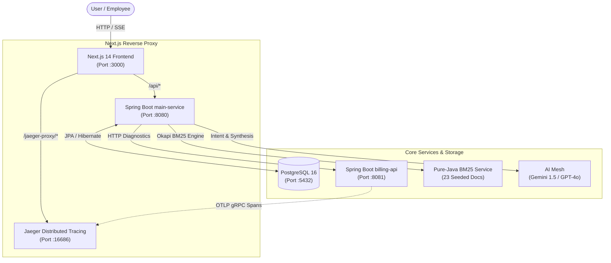
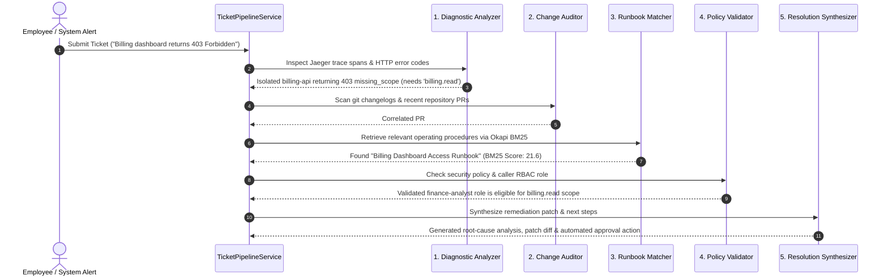
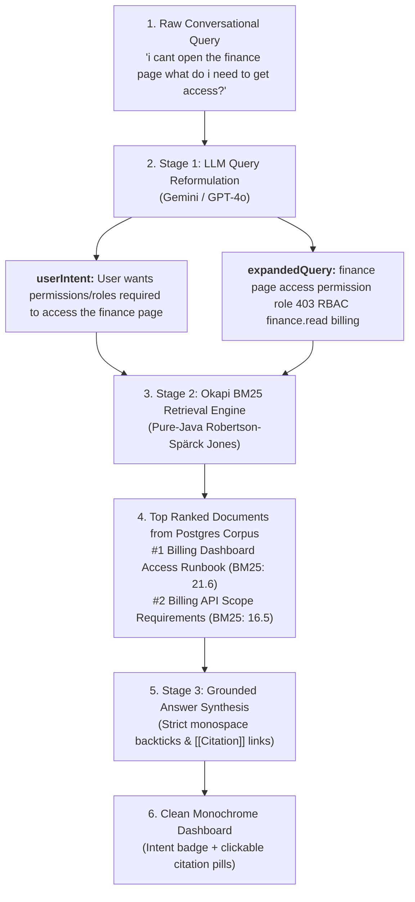

# Velloe (Meridian)

> **Autonomous IT Issue-Triage System & Distributed Knowledge Copilot**  
> *Self-healing microservice diagnostics, multi-agent root-cause analysis, and two-stage Okapi BM25 knowledge retrieval.*

[](https://openjdk.org/)
[](https://spring.io/projects/spring-boot)
[](https://nextjs.org/)
[](https://www.postgresql.org/)
[](https://opentelemetry.io/)
[](https://www.jaegertracing.io/)
[](https://tailwindcss.com/)

---

## 📑 Table of Contents
- [Overview & The Problem](#-overview--the-problem)
- [System Architecture](#-system-architecture)
- [Key Features Explained](#-key-features-explained)
  - [1. Autonomous Multi-Agent Ticket Triage Pipeline](#1-autonomous-multi-agent-ticket-triage-pipeline)
  - [2. Two-Stage RAG: LLM Query Reformulation + Okapi BM25](#2-two-stage-rag-llm-query-reformulation--okapi-bm25)
  - [3. Dynamic AI Explanations in the Employee Portal](#3-dynamic-ai-explanations-in-the-employee-portal)
  - [4. Distributed Tracing with OpenTelemetry & Jaeger](#4-distributed-tracing-with-opentelemetry--jaeger)
  - [5. Developer-First Monochrome Interface](#5-developer-first-monochrome-interface)
  - [6. Pre-Seeded Knowledge Corpus (23 Documents)](#6-pre-seeded-knowledge-corpus-23-documents)
- [Technology Stack](#-technology-stack)
- [Repository Structure](#-repository-structure)
- [Quick Start Guide](#-quick-start-guide)
  - [Prerequisites](#prerequisites)
  - [Step 1: Start Infrastructure (PostgreSQL & Jaeger)](#step-1-start-infrastructure-postgresql--jaeger)
  - [Step 2: Start Backend Microservices](#step-2-start-backend-microservices)
  - [Step 3: Start Frontend Dashboard](#step-3-start-frontend-dashboard)
- [REST API Reference](#-rest-api-reference)
- [License](#-license)

---

## 🔭 Overview & The Problem

In modern cloud environments, engineering teams spend countless hours triaging repetitive internal IT support tickets:
- **Opaque Errors**: Callers report ambiguous `403 Forbidden` or `504 Gateway Timeout` errors without knowing which microservice failed or which IAM scope was missing.
- **Silent Breakages**: A pull request modifying role templates inadvertently drops a default permission (e.g. PR #341 dropping `billing.read`), silently locking out entire departments.
- **Search Frustration**: Traditional search engines and vector embeddings often fail on exact technical tokens (e.g. distinguishing `billing-api` from `billing.read` or `403` vs `504`).
- **Unhelpful Rejections**: Employees whose access requests are denied receive opaque "Ticket Rejected" emails with zero context on why the policy rejected them or how to self-serve.

**Velloe (Meridian)** solves these challenges by combining **deterministic observability** (OpenTelemetry traces + Git changelogs), a **probabilistic lexical retrieval engine** (pure-Java Okapi BM25), and a **multi-agent AI orchestration pipeline**.

---

## 🏛 System Architecture

The following diagram illustrates how requests flow from the Next.js client through the reverse proxy, backend microservices, and observability mesh:



---

## ⚡ Key Features Explained

### 1. Autonomous Multi-Agent Ticket Triage Pipeline

When an incident alert triggers or an employee files a ticket, `TicketPipelineService` coordinates five specialized autonomous agents in a sequential DAG to diagnose and resolve the issue:



#### The Five Agents Breakdown:
1. **Diagnostic Analyzer**: Connects to the Jaeger trace store, identifies error spans, extracts HTTP status codes, and isolates the specific downstream failing service.
2. **Change Auditor**: Performs temporal correlation between the incident timestamp and recent Git pull requests or configuration updates to pinpoint what introduced the issue.
3. **Runbook Matcher**: Runs lexical search over internal runbooks to discover verified remediation procedures and post-mortems.
4. **Policy Validator**: Verifies company security rules and least-privilege RBAC standards to ensure automated actions do not bypass compliance guards.
5. **Resolution Synthesizer**: Formulates an executable resolution plan, automated permission grant, or dynamic human-in-the-loop approval card.

---

### 2. Two-Stage RAG: LLM Query Reformulation + Okapi BM25

Standard vector search frequently struggles with exact technical tokens (e.g. `billing.read`, `billing-analyst`, `403`). Velloe uses a **Two-Stage Retrieval Pipeline** that combines LLM reasoning with probabilistic lexical ranking:



#### Okapi BM25 Mathematical Formula:
Implemented natively in `Bm25Service.java` with zero external dependencies:

$$\text{Score}(D, Q) = \sum_{t \in Q} \text{IDF}(t) \cdot \frac{f(t, D) \cdot (k_1 + 1)}{f(t, D) + k_1 \cdot \left(1 - b + b \cdot \frac{|D|}{\text{avgdl}}\right)}$$

- **$k_1 = 1.2$**: Controls term frequency saturation.
- **$b = 0.75$**: Regulates document length normalization.
- **Token Splitting**: Technical identifiers like `billing-api` are split into both full terms and sub-tokens (`billing`, `api`) to maximize search recall.

#### Claude-Style Split Inspector:
Clicking any inline citation pill (e.g. `[[Billing Dashboard Access Runbook]]`) automatically slides open the side inspector panel featuring:
- **Sources Tab**: All ranked documents matching the query with their BM25 scores.
- **Document Tab**: Full markdown document reader with metadata and character counts.
- **All Docs Tab**: Instant search and filtering across the entire document corpus.

---

### 3. Dynamic AI Explanations in the Employee Portal

Instead of opaque rejections, Velloe provides employees with structured, transparent explanations generated dynamically by AI:

- **Empathetic Verdict**: Clear explanation of what was evaluated and why the request was closed or denied.
- **Technical Root Cause**: Plain-language breakdown of the underlying policy or configuration barrier (e.g. explaining why VPN password resets cannot be approved by infrastructure pipelines and must utilize the corporate IdP self-service portal).
- **Numbered Next Steps**: Step-by-step instructions directing the employee to the exact self-service portal, helpdesk team, or manager approval flow needed to unblock them.

---

### 4. Distributed Tracing with OpenTelemetry & Jaeger

- `billing-api` runs with the official **OpenTelemetry Javaagent 2.x**.
- All incoming requests generate spans with W3C `traceparent` context propagation.
- Traces are exported via gRPC (`localhost:4317`) into the Jaeger All-in-One collector.
- SREs can inspect the trace waterfall in the **Trace Ledger** tab to visualize latency, span hierarchy, and errors across services.

---

### 5. Developer-First Monochrome Interface

The user interface is designed for focus, readability, and speed:
- **Strict Black & White Palette**: Pure dark and light tones (`zinc-950`, `zinc-900`, `zinc-800`, `white`) without distracting neon colors.
- **Technical Highlighting via Backticks**: Identifiers, role names, and scopes (e.g. `billing.read`, `billing-analyst`, `403 Forbidden`) render as crisp monospace `<code>` tokens.
- **Full Viewport Fitting**: The chat interface and side inspector scale dynamically to `h-[calc(100vh-130px)]`, keeping the input field and suggested queries visible without awkward vertical page scrolling.

---

### 6. Pre-Seeded Knowledge Corpus (23 Documents)

The application automatically seeds 23 enterprise engineering documents into PostgreSQL on first launch:
- **Runbooks**: Billing API Scopes, Database Pool Exhaustion, Kafka Consumer Lag, K8s Pod CrashLoopBackOff, Ingress 504 Timeout, IdP Account Recovery, Analytics Access, Auth Service Scopes.
- **Policies**: Corporate VPN Access & Self-Service Password Reset, Enterprise RBAC & Mutual TLS, Vault Secret Rotation, Audit Retention, Incident Severity SLAs.
- **Post-Mortems**: Billing Dashboard 403 Permissions Outage (PR #341), Kafka Consumer Rebalancing Storm, Memory Leak in CSV Exporter.

---

## 🛠 Technology Stack

| Domain | Technology | Details |
|---|---|---|
| **Frontend Framework** | **Next.js 14** (App Router) | React 18, Server & Client Components, Route Handlers |
| **Styling & Motion** | **Tailwind CSS v4** | Framer Motion animations, GSAP hardware custom cursor |
| **Backend Framework** | **Spring Boot 3.2.0** | Java 21 / 23, Spring MVC, REST APIs, SSE Streaming |
| **Data Layer** | **PostgreSQL 16** | Spring Data JPA, Hibernate, Relational Schema |
| **Information Retrieval** | **Okapi BM25** (Pure-Java) | Robertson–Spärck Jones probabilistic scoring ($k_1=1.2, b=0.75$) |
| **AI Mesh** | **Google Gemini 1.5** & **GPT-4o** | Two-stage query reformulation, intent extraction, grounded synthesis |
| **Distributed Tracing** | **OpenTelemetry Javaagent** | Automatic bytecode instrumentation, W3C TraceContext propagation |
| **Trace Storage & UI** | **Jaeger All-in-One** | OTLP gRPC collector (`:4317`), Web Console (`:16686`) |
| **Containerization** | **Docker Compose** | Isolated containers for PostgreSQL and Jaeger |

---

## 📂 Repository Structure

```
velloe/
├── docker-compose.yml              # PostgreSQL 16 & Jaeger All-in-One containers
├── README.md                       # System documentation & architectural reference
├── backend/
│   ├── pom.xml                     # Maven parent aggregator pom
│   ├── main-service/               # Primary orchestrator & triage service (:8080)
│   │   ├── pom.xml
│   │   └── src/main/java/com/velloe/mainservice/
│   │       ├── controller/         # REST Controllers (Ask, Ticket, Health, Explanation)
│   │       ├── dto/                # Request & Response Data Transfer Objects
│   │       ├── model/              # JPA Entities (Document, Ticket, AgentStep)
│   │       ├── repository/         # Spring Data JPA Repositories
│   │       ├── seeder/             # DataSeeder (23 Runbooks, Policies, Post-Mortems)
│   │       └── service/            # Core business logic
│   │           ├── AskService.java           # Two-stage RAG (Intent + Expansion + BM25)
│   │           ├── Bm25Service.java          # Pure-Java Okapi BM25 engine
│   │           ├── TicketExplanationService.java # Dynamic AI rejection explanation
│   │           ├── llm/                      # Gemini & OpenAI client wrappers
│   │           └── pipeline/                 # 5-Agent Triage Pipeline (Analyzer, Auditor, etc.)
│   └── billing-api/                # Downstream microservice (:8081)
│       ├── pom.xml
│       ├── opentelemetry-javaagent.jar # OTEL Javaagent for distributed tracing
│       └── src/main/java/com/velloe/billingapi/
│           ├── controller/         # Billing endpoints (seeded 403 missing_scope bug)
│           └── BillingApiApplication.java
└── frontend/                       # Next.js 14 modern UI dashboard (:3000)
    ├── package.json
    ├── next.config.mjs             # Reverse proxy rewrites for /api/* and /jaeger-proxy/*
    ├── tailwind.config.js
    └── src/
        ├── app/                    # Next.js App Router (page.js, layout.js, globals.css)
        ├── components/
        │   ├── layout/             # Header, Sidebar, BrandLogo, CustomCursor
        │   ├── glean/              # GleanChatView (Meri Copilot, Split Inspector)
        │   ├── mission/            # TicketListView, TicketDetailView, PipelineGraph
        │   ├── employee/           # EmployeePortalView (AI Rejection Explanations)
        │   └── audit/              # TraceLedgerView (Jaeger span inspection)
        └── services/               # API clients & seed data
```

---

## 🚀 Quick Start Guide

### Prerequisites
- **Java 21** or higher (`java -version`)
- **Node.js 18+** & **npm** (`node -v`, `npm -v`)
- **Docker** & **Docker Compose** (`docker compose version`)
- **Maven 3.8+** (or bundled IDE Maven)

---

### Step 1: Start Infrastructure (PostgreSQL & Jaeger)

From the repository root, start the supporting containers:

```bash
docker compose up -d
```

Verify containers are healthy:
```bash
docker ps
```
- **PostgreSQL 16**: `localhost:5432` (`user: velloe`, `db: velloe`, `password: velloe_password`)
- **Jaeger Web UI**: [http://localhost:16686](http://localhost:16686)
- **Jaeger OTLP gRPC**: `localhost:4317`

---

### Step 2: Start Backend Microservices

#### A. Start `main-service` (Port 8080)
```bash
cd backend/main-service

# Provide your LLM API keys (fallbacks are enabled if omitted)
export GEMINI_API_KEY="your-gemini-api-key"
export OPENAI_API_KEY="your-openai-api-key"
export PORT=8080

# Build and run
mvn clean package -DskipTests
java -jar target/main-service-0.0.1-SNAPSHOT.jar
```

Verify `main-service` is accepting traffic:
```bash
curl http://localhost:8080/actuator/health
# Response: {"status":"UP"}
```

#### B. Start `billing-api` with OpenTelemetry (Port 8081)
In a new terminal window:
```bash
cd backend/billing-api

# Build jar
mvn clean package -DskipTests

# Run with OpenTelemetry Javaagent attached
OTEL_EXPORTER_OTLP_ENDPOINT="http://localhost:4317" \
OTEL_EXPORTER_OTLP_PROTOCOL="grpc" \
OTEL_SERVICE_NAME="billing-api" \
OTEL_TRACES_EXPORTER="otlp" \
java -javaagent:opentelemetry-javaagent.jar \
     -jar target/billing-api-0.0.1-SNAPSHOT.jar
```

Verify `billing-api` health:
```bash
curl http://localhost:8081/actuator/health
# Response: {"status":"UP"}
```

---

### Step 3: Start Frontend Dashboard

In a new terminal window:
```bash
cd frontend

# Install dependencies
npm install

# Start Next.js development server
npm run dev
```

Open your browser at:
👉 **[http://localhost:3000](http://localhost:3000)**

---

## 📡 REST API Reference

### Two-Stage RAG & Documentation Search

#### `POST /api/ask`
Submits a query to the Two-Stage Copilot.
```bash
curl -X POST http://localhost:8080/api/ask \
  -H "Content-Type: application/json" \
  -d '{"question":"i cant open the finance page what do i need to get access?"}'
```

**Response:**
```json
{
  "answer": "To access the finance page (billing dashboard), employees in `billing-analyst` or `finance-manager` roles require both `billing.view` and `billing.read` scopes [[Billing Dashboard Access Runbook]]. Access will fail immediately with `403` if `billing.read` is not active [[Billing Dashboard Access Runbook]].",
  "userIntent": "The user is unable to access the finance page and wants to know what permissions, roles, or access requests are required to view it.",
  "expandedQuery": "finance page access permission role authorization IAM 403 Forbidden insufficient privileges finance.read RBAC request access",
  "citedDocuments": [
    "Billing Dashboard Access Runbook"
  ],
  "retrievedDocuments": [
    {
      "id": "03361856-461e-4208-85c8-cc75bd95da98",
      "title": "Billing Dashboard Access Runbook",
      "type": "RUNBOOK",
      "content": "Employees in billing-analyst or finance-manager roles require both billing.view and billing.read scopes. Access to the billing dashboard fails immediately with HTTP 403 if billing.read is not active.",
      "score": 21.6
    }
  ]
}
```

#### `GET /api/docs`
Retrieves all seeded enterprise runbooks, policies, and post-mortems.

---

### Multi-Agent Ticket Triage

#### `GET /api/tickets`
Fetches all active tickets and their autonomous pipeline statuses (`TRIAGED`, `INVESTIGATING`, `RESOLVED`, `REJECTED`).

#### `GET /api/tickets/{id}/steps`
Retrieves the real-time multi-agent execution timeline (Diagnostic Analyzer, Change Auditor, Runbook Matcher, Policy Validator, Resolution Synthesizer).

#### `GET /api/tickets/{id}/explain`
Retrieves the dynamic AI explanation for a rejected ticket, including root-cause analysis and numbered next steps.

---

## 📄 License

This project is licensed under the Apache 2.0 License.
